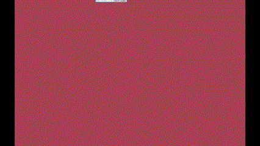

# Weather and forecasting App

> Exercise to refactor pure javascript app to incorporate react frontend.
> Also familiarize with some google cloud functionality and API endpoints.
> 
> Live demo [_here_](https://shouwangh.github.io/weather-app-react/). 

## Table of Contents
* [General Info](#general-information)
* [Technologies Used](#technologies-used)
* [Acknowledgements](#acknowledgements)
* [Contact](#contact)

## General Information
> Weather app which uses google geocaching to find longitude and latitude and input into weather api
> There may be further updates to include accessing geolocation of user
> 

## Technologies Used

## Acknowledgements
- Various CSS items were retooled including the display cards and various weather icons
## Contact
- Feel free to peruse other projects or contact me below.

